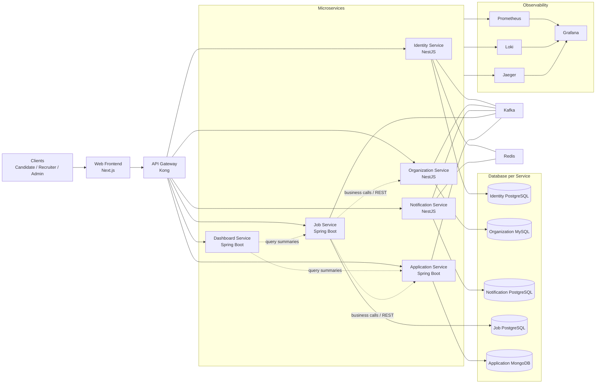
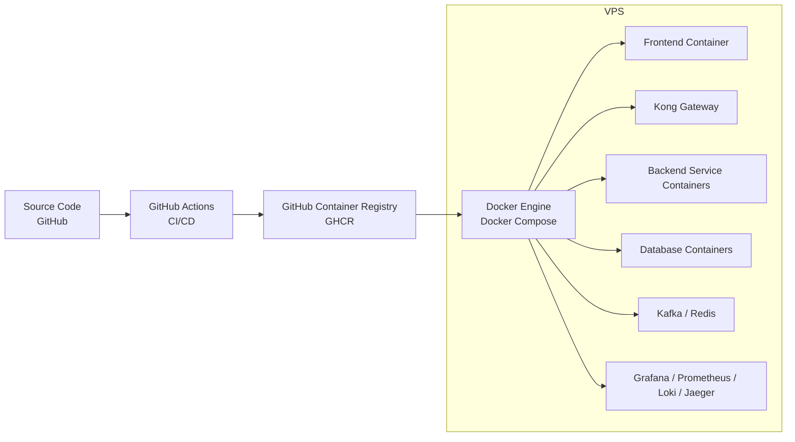
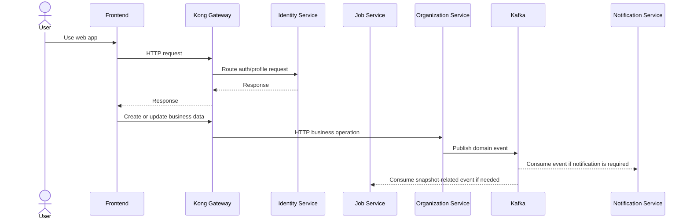
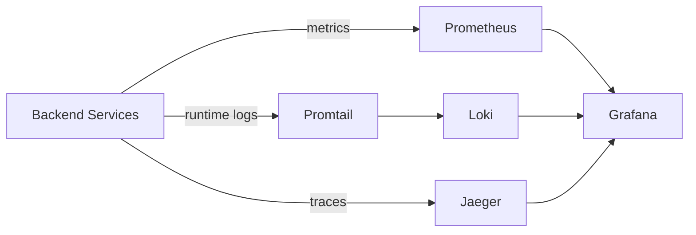
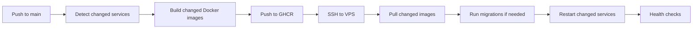

# IT Job Platform Backend

Backend monorepo for **IT Job Platform**, a job marketplace focused on IT recruitment in Vietnam. The system is designed as a microservices-based platform with API gateway routing, database per service, asynchronous events, observability, CI/CD, automated tests, and VPS deployment.

The frontend repository lives at `../it-job-platform-fe`.

## Table of Contents

- [Overview](#overview)
- [Key Features](#key-features)
- [Architecture](#architecture)
- [Services](#services)
- [Technology Stack](#technology-stack)
- [Repository Structure](#repository-structure)
- [Default Ports](#default-ports)
- [Environment Configuration](#environment-configuration)
- [Local Development](#local-development)
- [Database Migration and Seed](#database-migration-and-seed)
- [Demo Accounts](#demo-accounts)
- [Automation Tests](#automation-tests)
- [Observability](#observability)
- [CI/CD and Deployment](#cicd-and-deployment)
- [VPS Operations](#vps-operations)
- [Useful Scripts](#useful-scripts)
- [Troubleshooting](#troubleshooting)

## Overview

IT Job Platform supports three main user roles:

- **Candidate**: searches jobs, saves favorites, applies to jobs, manages profile and CV.
- **Recruiter**: manages company-related hiring flows, posts jobs, reviews applications.
- **Administrator**: manages platform data, reviews jobs, monitors dashboard and system activity.

The backend is split into domain-oriented services. Each service owns a clear responsibility and, where applicable, its own database. The platform also includes Kafka, Redis, Kong Gateway, Grafana, Prometheus, Loki, Jaeger, and GitHub Actions workflows.

## Key Features

- Authentication, authorization, email verification, password reset.
- User, candidate, recruiter and admin workflows.
- Company, branch and category management.
- Job posting, review, search, recommendation and favorites.
- Job application workflow and application status management.
- Notification and email delivery pipeline.
- Admin dashboard summary and report export.
- API automation, UI E2E automation integration, and performance testing.
- Metrics, logs, traces, dashboards and design-for-failure demo.
- GHCR-based image publishing and VPS deployment.

## Architecture

### Logical Architecture



### Deployment Architecture



### Runtime Communication



## Services

| Service | Runtime | Responsibility | Database | Default Port |
| --- | --- | --- | --- | --- |
| `identity-service` | NestJS | Authentication, users, roles, candidate/recruiter profile, company snapshots | PostgreSQL | `3001` |
| `organization-service` | NestJS | Companies, branches, categories, organization domain events | MySQL | `3002` |
| `notification-service` | NestJS | Notifications, email jobs, Graphile Worker background tasks | PostgreSQL | `3003` |
| `job-service` | Spring Boot | Jobs, job review, recommendations, favorites, category snapshots | PostgreSQL | `8082` |
| `application-service` | Spring Boot | Applications, application status workflow, candidate/recruiter application views | MongoDB | `8083` |
| `dashboard-service` | Spring Boot | Admin dashboard summary, reports, graceful degradation demo | Internal HTTP clients | `8084` |
| `gateway/kong` | Kong | API routing from frontend to backend services | N/A | `8000` |

## Technology Stack

### Backend

- **NestJS** for identity, organization and notification services.
- **Spring Boot** for job, application and dashboard services.
- **PostgreSQL**, **MySQL**, and **MongoDB** as polyglot persistence.
- **Kafka** for asynchronous domain communication.
- **Redis** for fast temporary storage and cache-oriented workflows.
- **Kong Gateway** as the single API entry point.
- **Docker Compose** for local/VPS orchestration.

### Observability

- **Prometheus** for metrics scraping and k6 remote write.
- **Loki** for centralized logs.
- **Promtail** for shipping runtime logs to Loki.
- **Jaeger** for distributed traces.
- **Grafana** for dashboards.

### Automation

- **Node test runner** for API automation.
- **Playwright** in the frontend repository for UI E2E tests.
- **k6** for smoke, spike and stress performance scenarios.
- **GitHub Actions** for build, test, deploy and demo workflows.
- **GHCR** for Docker image publishing.

## Repository Structure

```text
it-job-platform/
├── .github/workflows/              # Backend deploy, API automation, performance, failure demo
├── gateway/kong/                   # Kong declarative routing config
├── infrastructure/
│   ├── kafka/                      # Kafka compose, scripts and topic definitions
│   ├── load-testing/               # k6 scenarios and config
│   ├── observability/              # Grafana, Prometheus, Loki, Promtail, Jaeger config
│   ├── redis/                      # Redis config
│   └── databases/                  # Per-database compose files
├── scripts/
│   ├── db/                         # migrate/seed/reset scripts
│   └── dev/                        # local/VPS deploy, tests, demo and operation scripts
├── services/
│   ├── identity-service/
│   ├── organization-service/
│   ├── notification-service/
│   ├── job-service/
│   ├── application-service/
│   └── dashboard-service/
├── tests/api/                      # API automation tests
├── docker-compose.yml              # Infra, databases, gateway, observability
├── docker-compose.app.yml          # Application containers
└── .env.example                    # Root environment template
```

## Default Ports

| Component | URL |
| --- | --- |
| Frontend | `http://localhost:3000` |
| Kong Gateway | `http://localhost:8000` |
| Kong Admin | `http://localhost:8001` |
| Identity Service | `http://localhost:3001` |
| Organization Service | `http://localhost:3002` |
| Notification Service | `http://localhost:3003` |
| Job Service | `http://localhost:8082` |
| Application Service | `http://localhost:8083` |
| Dashboard Service | `http://localhost:8084` |
| Kafka UI | `http://localhost:8080` |
| Prometheus | `http://localhost:9090` |
| Grafana | `http://localhost:3005` |
| Jaeger | `http://localhost:16686` |

## Environment Configuration

Create the root environment file:

```bash
cp .env.example .env
```

PowerShell:

```powershell
Copy-Item .env.example .env
```

Important rules:

- The root `.env` is the main source for Docker Compose and VPS deployment.
- Service-level `.env` files are useful only when running individual services directly on the host.
- Do not commit `.env` or `.env.*` files. They are intentionally ignored.
- For VPS deployment, keep secrets in the VPS root `.env` and GitHub Actions secrets/variables.

## Local Development

### Prerequisites

- Docker Desktop or Docker Engine.
- Node.js 20+ and npm 10+.
- Java 17.
- Maven 3.9+.
- Git.

### Start infrastructure

From the backend repo root:

```bash
docker compose up -d
```

This starts:

- Databases: PostgreSQL, MySQL, MongoDB.
- Kafka and Kafka UI.
- Redis.
- Kong Gateway.
- Prometheus, Grafana, Loki, Promtail, Jaeger.

### Start backend services on the host

Open separate terminals.

NestJS services:

```bash
cd services/identity-service
npm install
npm run start:dev
```

```bash
cd services/organization-service
npm install
npm run start:dev
```

```bash
cd services/notification-service
npm install
npm run start:dev
```

Spring Boot services:

```bash
cd services/job-service
mvn spring-boot:run
```

```bash
cd services/application-service
mvn spring-boot:run
```

```bash
cd services/dashboard-service
mvn spring-boot:run
```

### Start the complete app stack using Docker images

If images are available locally or via GHCR:

```bash
docker compose -f docker-compose.yml -f docker-compose.app.yml up -d
```

## Database Migration and Seed

Seed all supported services:

```bash
bash ./scripts/db/seed.sh
```

PowerShell:

```powershell
.\scripts\db\seed.ps1
```

Seed a specific service:

```bash
bash ./scripts/db/seed.sh identity-service
bash ./scripts/db/seed.sh organization-service
bash ./scripts/db/seed.sh notification-service
bash ./scripts/db/seed.sh job-service
bash ./scripts/db/seed.sh application-service
```

The seed script is intended for demo data. It runs migrations where needed and inserts representative data for accounts, companies, categories, jobs, applications and notifications.

## Demo Accounts

| Role | Email | Password |
| --- | --- | --- |
| Admin | `admin@example.com` | `admin123` |
| Recruiter | `recruiter@example.com` | `recruiter123` |
| Candidate | `candidate@example.com` | `candidate123` |

## Automation Tests

### API Automation

Run API tests on a ready VPS stack:

```bash
bash ./scripts/dev/run-api-automation-vps.sh
```

Run with demo data preparation:

```bash
PREPARE_DEMO_DATA=true bash ./scripts/dev/run-api-automation-vps.sh
```

The workflow `API Automation VPS` can also be triggered manually from GitHub Actions. It writes a structured automation result log that is collected by Loki and shown in Grafana.

### Performance Tests

Performance tests are located in `infrastructure/load-testing`.

Scenarios:

- `smoke`: quick low-load validation.
- `spike`: sudden traffic increase.
- `stress`: higher pressure to evaluate system limits.

Run on VPS:

```bash
bash ./scripts/dev/run-k6-vps.sh smoke demo-smoke-001
bash ./scripts/dev/run-k6-vps.sh spike demo-spike-001
bash ./scripts/dev/run-k6-vps.sh stress demo-stress-001
```

Override peak VUs:

```bash
PEAK_VUS=50 bash ./scripts/dev/run-k6-vps.sh stress demo-stress-50
```

Performance results are sent to Prometheus and summarized in Grafana dashboards.

### Design for Failure Demo

The graceful degradation demo intentionally stops `organization-service` and verifies that `job-service` still serves job browsing from its own job database and local category snapshots.

Run the full demo:

```bash
bash ./scripts/dev/demo-graceful-degradation-vps.sh full
```

Run step by step:

```bash
bash ./scripts/dev/demo-graceful-degradation-vps.sh baseline
bash ./scripts/dev/demo-graceful-degradation-vps.sh inject-failure
bash ./scripts/dev/demo-graceful-degradation-vps.sh check-degraded
bash ./scripts/dev/demo-graceful-degradation-vps.sh recover
bash ./scripts/dev/demo-graceful-degradation-vps.sh verify-recovered
```

The demo can be run over SSH on the VPS and observed through service logs.

## Observability

### Dashboards

Grafana is available at:

```text
http://localhost:3005
```

On VPS, replace `localhost` with the public server IP or domain.

Dashboard groups:

- **Overview**
  - `Backend Overview`: traffic, latency, 5xx errors and business events.
  - `Backend Service Logs`: centralized runtime logs for backend services.
  - `System Health`: process uptime, memory and Prometheus scrape status.
- **Automation Tests**
  - `API Automation Test`
  - `UI E2E Test`
  - `Performance Smoke`
  - `Performance Spike`
  - `Performance Stress`

### Metrics, Logs and Traces



| Tool | Purpose |
| --- | --- |
| Prometheus | Scrapes service and k6 metrics |
| Loki | Stores structured service and automation logs |
| Promtail | Ships runtime log files into Loki |
| Jaeger | Stores distributed traces |
| Grafana | Visualizes metrics, logs, traces and automation results |

### Business Events

Business events are domain-level events exposed as Prometheus counters. They show what meaningful business activity happened, not only raw HTTP traffic.

Examples:

- Authentication success/failure.
- Organization mutations such as company, branch or category changes.
- Notification creation and email job results.
- Job mutations.
- Application events.
- Dashboard report operations.

## CI/CD and Deployment

### Backend Deployment Flow



Workflow: `.github/workflows/deploy-backend.yml`

Behavior:

- Push to `main` triggers deployment.
- Manual dispatch builds all backend services.
- Changed-service detection avoids rebuilding every service on every push.
- Images are pushed to GHCR with `main` and `sha-<commit>` tags.
- VPS pulls images and recreates only relevant services.
- Optional `run_seed` input runs full demo migration and seed.

### Required GitHub Secrets

| Secret | Purpose |
| --- | --- |
| `VPS_HOST` | VPS host or IP |
| `VPS_USER` | SSH username |
| `VPS_SSH_KEY` | Private SSH key for VPS |
| `VPS_PORT` | Optional SSH port |

### Required GitHub Variables

| Variable | Purpose |
| --- | --- |
| `VPS_BACKEND_PATH` | Backend path on VPS, usually `/opt/it-job/it-job-platform` |

## VPS Operations

Expected backend path:

```bash
/opt/it-job/it-job-platform
```

### Deploy or Resume Stack

```bash
cd /opt/it-job/it-job-platform
bash ./scripts/dev/deploy-backend-vps.sh
```

Resume the complete stack and run seed:

```bash
cd /opt/it-job/it-job-platform
bash ./scripts/dev/resume-vps.sh
```

### Manage Services

The service management script provides safe start/stop/restart/status/log commands for the VPS stack.

```bash
cd /opt/it-job/it-job-platform

bash ./scripts/dev/service-vps.sh stop job-service
bash ./scripts/dev/service-vps.sh start job-service
bash ./scripts/dev/service-vps.sh restart notification-service
bash ./scripts/dev/service-vps.sh status app
bash ./scripts/dev/service-vps.sh logs notification-service
```

Supported groups:

- `app`
- `backend`
- `infra`
- `observability`
- `all`

The script uses `stop`, `up -d`, `restart`, `ps`, and `logs`. It does not run `docker compose down`, so it does not remove database volumes.

### Cleanup Disk Space

Common safe cleanup commands:

```bash
docker builder prune -af
docker image prune -af
docker container prune -f
journalctl --vacuum-size=256M
```

Do not prune volumes unless you intentionally want to remove database data.

## Useful Scripts

| Script | Purpose |
| --- | --- |
| `scripts/db/seed.sh` | Run migrations and seed demo data |
| `scripts/db/migrate.sh` | Run database migrations |
| `scripts/dev/deploy-backend-vps.sh` | Deploy backend stack on VPS |
| `scripts/dev/resume-vps.sh` | Resume full VPS stack and validate health |
| `scripts/dev/wait-app-stack-vps.sh` | Wait until app stack is ready |
| `scripts/dev/service-vps.sh` | Start/stop/restart/status/log services |
| `scripts/dev/run-api-automation-vps.sh` | Run API automation on VPS |
| `scripts/dev/run-k6-vps.sh` | Run k6 performance tests |
| `scripts/dev/demo-graceful-degradation-vps.sh` | Run design-for-failure demo |
| `scripts/dev/write-automation-log.sh` | Write automation result log for Loki |
| `scripts/dev/sync-service-env-files.sh` | Generate service-level env files from root env |
| `scripts/dev/normalize-db-passwords.sh` | Align local database passwords with root env |

## Troubleshooting

### Demo account cannot log in

Run seed:

```bash
bash ./scripts/db/seed.sh identity-service
```

Check identity database credentials in root `.env` and container env:

```bash
docker compose exec identity-service printenv DATABASE_URL
docker compose exec identity-postgres psql -U postgres -d postgres -c '\du'
```

### Notification service returns 500

Check database and Graphile Worker configuration:

```bash
docker compose logs --tail 120 notification-service
docker compose exec notification-service printenv DATABASE_URL
docker compose exec notification-service printenv GRAPHILE_WORKER_DATABASE_URL
```

### Kafka UI is not reachable

```bash
docker compose up -d kafka kafka-ui
docker compose logs --tail 100 kafka-ui
```

Default URL:

```text
http://localhost:8080
```

### Grafana dashboard shows no data

Verify data sources:

```bash
curl -fsS http://localhost:9090/-/ready
curl -fsS http://localhost:3100/ready
curl -fsS http://localhost:3005/api/health
```

Run workload:

```bash
bash ./scripts/dev/run-api-automation-vps.sh
bash ./scripts/dev/run-k6-vps.sh smoke demo-smoke-readme
```

### Docker disk usage is high

```bash
docker system df
docker builder prune -af
docker image prune -af
```

### Health check endpoints

```bash
curl -fsS http://localhost:8000/identity/health
curl -fsS http://localhost:3001/health
curl -fsS http://localhost:3002/health
curl -fsS http://localhost:3003/health
curl -fsS http://localhost:8082/api/health
curl -fsS http://localhost:8083/api/health
curl -fsS http://localhost:8084/api/health
```

## Notes

- The backend and frontend are separate repositories.
- The backend repository owns the infrastructure stack and Docker Compose deployment files.
- The frontend deployment workflow uses this repository path on VPS to restart the `frontend` service.
- Keep `.env` files local and private.
- For a presentation-oriented walkthrough, see `DEMO.md` and `DEMO_AUTOMATION_OBSERVABILITY.md`.
